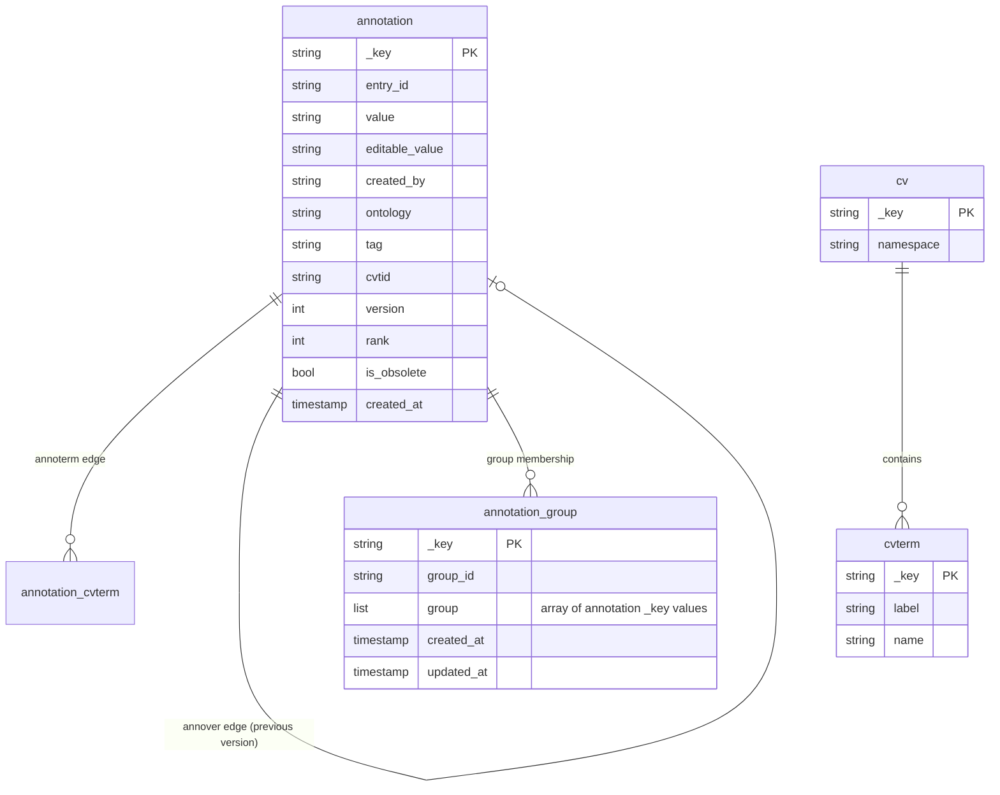
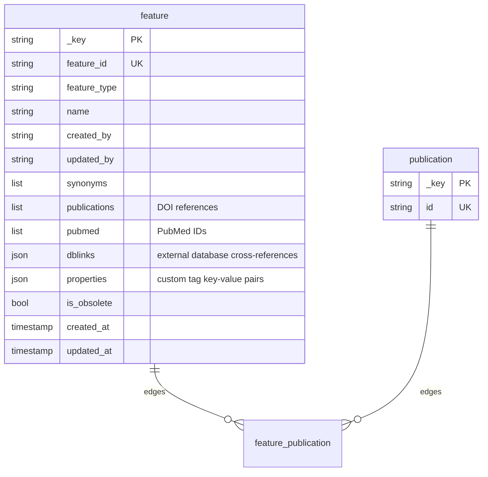

# modware-annotation
[](LICENSE)  

[](https://codecov.io/gh/dictyBase/modware-annotation)   
   
[](https://reporter.nih.gov/project-details/10024726)

gRPC microservice for managing biological annotations and feature annotations in dictyBase. Backed by ArangoDB.

On every create, update, or delete mutation the service publishes a protobuf-serialized event to NATS so that downstream services can react without polling.

- [Running the Server](#running-the-server)
  - [Core Flags](#core-flags)
  - [ArangoDB Collection Flags — Tagged Annotations](#arangodb-collection-flags--tagged-annotations)
  - [ArangoDB Collection Flags — Feature Annotations](#arangodb-collection-flags--feature-annotations)
  - [Ontology Flags](#ontology-flags)
- [NATS Events](#nats-events)
- [gRPC API](#grpc-api)
  - [Tagged Annotation Service Methods](#tagged-annotation-service-methods)
  - [Feature Annotation Service Methods](#feature-annotation-service-methods)
  - [Connect with Go](#connect-with-go)
  - [Create an Annotation](#create-an-annotation)
  - [Get an Annotation](#get-an-annotation)
  - [Update an Annotation](#update-an-annotation)
  - [Delete an Annotation](#delete-an-annotation)
  - [List Annotations with Pagination and Filters](#list-annotations-with-pagination-and-filters)
  - [Filtering](#filtering)
  - [Annotation Groups](#annotation-groups)
  - [Create a Feature Annotation](#create-a-feature-annotation)
  - [Get a Feature Annotation](#get-a-feature-annotation)
  - [Update a Feature Annotation](#update-a-feature-annotation)
  - [Tag Operations on Feature Annotations](#tag-operations-on-feature-annotations)
  - [List Feature Annotations by Publication](#list-feature-annotations-by-publication)
- [ArangoDB Schema](#arangodb-schema)

## Running the Server

Two gRPC servers are available: `start-server` for tagged annotations (port 9560) and `start-feature-server` for feature annotations (port 9570). See `--help` on each command for the full flag list.

```bash
# Tagged annotation server
modware-annotation start-server \
  --port 9560 \
  --arangodb-database annotation \
  --arangodb-user root \
  --arangodb-pass secret \
  --arangodb-host arangodb \
  --arangodb-port 8529 \
  --nats-host nats \
  --nats-port 4222

# Feature annotation server
modware-annotation start-feature-server \
  --port 9570 \
  --arangodb-database annofeature \
  --arangodb-user root \
  --arangodb-pass secret \
  --arangodb-host arangodb \
  --arangodb-port 8529 \
  --nats-host nats \
  --nats-port 4222
```

### Core Flags

Common to all commands.

| Flag | Default | Description |
|------|---------|-------------|
| `--log-format` | `json` | Logging output format (`json` or `text`) |
| `--log-level` | `error` | Log level (`debug`, `warn`, `error`, `fatal`, `panic`) |

### Server Flags (both `start-server` and `start-feature-server`)

| Flag | Default | Env Variable | Description |
|------|---------|--------------|-------------|
| `--port` | `9560` / `9570` | — | gRPC server listen port |
| `--arangodb-database, --db` | `annotation` / `annofeature` | `ARANGODB_DATABASE` | ArangoDB database name |
| `--arangodb-user` | — | `ARANGODB_USER` | ArangoDB user |
| `--arangodb-pass` | — | `ARANGODB_PASS` | ArangoDB password |
| `--arangodb-host` | — | `ARANGODB_SERVICE_HOST` | ArangoDB host |
| `--arangodb-port` | — | `ARANGODB_SERVICE_PORT` | ArangoDB port |
| `--is-secure` | `false` | — | Use TLS for ArangoDB |
| `--nats-host` | — | `NATS_SERVICE_HOST` | NATS host |
| `--nats-port` | — | `NATS_SERVICE_PORT` | NATS port |

### ArangoDB Collection Flags — Tagged Annotations

Control the names of collections, edges, and graphs used by `start-server`. Defaults match the dictyBase production configuration.

| Flag | Default | Description |
|------|---------|-------------|
| `--anno-collection` | `annotation` | Document collection for annotations |
| `--annogroup-collection` | `annotation_group` | Document collection for annotation groups |
| `--annoterm-collection` | `annotation_cvterm` | Edge collection linking annotation → ontology term |
| `--annover-collection` | `annotation_version` | Edge collection linking old → new annotation versions |
| `--annoterm-graph` | `annotation_tag` | Named graph over `annotation_cvterm` edges |
| `--annover-graph` | `annotation_history` | Named graph over `annotation_version` edges |

### ArangoDB Collection Flags — Feature Annotations

Control the names of collections, edges, and graphs used by `start-feature-server`.

| Flag | Default | Description |
|------|---------|-------------|
| `--feature-collection` | `feature` | Document collection for feature annotations |
| `--pub-collection` | `publication` | Document collection for publications |
| `--edge-collection` | `feature_publication` | Edge collection linking feature → publication |
| `--feature-graph` | `feature_pub_graph` | Named graph over `feature_publication` edges |

### Ontology Flags

These flags configure which ontologies are loaded into ArangoDB and used by the tagged annotation service. The referenced ontologies must be loaded before the service starts (see `load-ontologies` command).

| Flag | Default | Description |
|------|---------|-------------|
| `--term-collection` | `cvterm` | Collection for ontology terms |
| `--rel-collection` | `cvterm_relationship` | Edge collection for term relationships |
| `--cv-collection` | `cv` | Collection for ontology metadata |
| `--obograph` | `obograph` | Named graph for the ontology graph |

```bash
# Load ontologies before starting the server
modware-annotation load-ontologies \
  --arangodb-database annotation \
  --arangodb-user root \
  --arangodb-pass secret \
  --arangodb-host arangodb \
  --obograph path/to/obograph.json
```

## NATS Events

### Tagged Annotations

| Operation | NATS Subject | Payload |
|-----------|-------------|---------|
| Create annotation | `AnnotationService.Create` | `TaggedAnnotation` |
| Update annotation | `AnnotationService.Update` | `TaggedAnnotation` |
| Delete annotation | `AnnotationService.Delete` | `TaggedAnnotation` |

### Feature Annotations

| Operation | NATS Subject | Payload |
|-----------|-------------|---------|
| Create feature annotation | `FeatureAnnotationService.Create` | `FeatureAnnotation` |
| Update feature annotation | `FeatureAnnotationService.Update` | `FeatureAnnotation` |
| Add / set / remove tags | `FeatureAnnotationService.Update` | `FeatureAnnotation` |

Deserialize using `proto.Unmarshal` with the generated types from `github.com/dictyBase/go-genproto/dictybaseapis/annotation` or `github.com/dictyBase/go-genproto/dictybaseapis/feature_annotation`.

## gRPC API

Full protobuf definitions: [dictybaseapis/annotation.proto](https://github.com/dictyBase/dictybaseapis/blob/master/dictybase/annotation/annotation.proto) and [dictybaseapis/feature_annotation.proto](https://github.com/dictyBase/dictybaseapis/blob/master/dictybase/feature_annotation/feature_annotation.proto).

### Tagged Annotation Service Methods

| Method | Request | Response | Description |
|--------|---------|----------|-------------|
| `GetAnnotation` | `AnnotationId` | `TaggedAnnotation` | Retrieve an annotation by ID |
| `GetEntryAnnotation` | `EntryAnnotationRequest` | `TaggedAnnotation` | Retrieve an annotation by entry ID |
| `ListAnnotations` | `ListParameters` | `TaggedAnnotationCollection` | Paginated annotation listing with filters |
| `CreateAnnotation` | `NewTaggedAnnotation` | `TaggedAnnotation` | Create a new annotation |
| `UpdateAnnotation` | `TaggedAnnotationUpdate` | `TaggedAnnotation` | Update an existing annotation |
| `DeleteAnnotation` | `DeleteAnnotationRequest` | `Empty` | Delete an annotation |
| `CreateAnnotationGroup` | `AnnotationIdList` | `TaggedAnnotationGroup` | Create a group from multiple annotations |
| `GetAnnotationGroup` | `GroupEntryId` | `TaggedAnnotationGroup` | Retrieve an annotation group by ID |
| `AddToAnnotationGroup` | `AnnotationGroupId` | `TaggedAnnotationGroup` | Add annotations to an existing group |
| `DeleteAnnotationGroup` | `GroupEntryId` | `Empty` | Delete an annotation group |
| `ListAnnotationGroups` | `ListGroupParameters` | `TaggedAnnotationGroupCollection` | Paginated group listing with filters |
| `GetAnnotationTag` | `TagRequest` | `AnnotationTag` | Retrieve an ontology tag by ID |
| `OboJSONFileUpload` | `stream FileUploadRequest` | `FileUploadResponse` | Stream-upload an OBO JSON ontology file |

### Feature Annotation Service Methods

| Method | Request | Response | Description |
|--------|---------|----------|-------------|
| `CreateFeatureAnnotation` | `NewFeatureAnnotation` | `FeatureAnnotation` | Create a new feature annotation |
| `GetFeatureAnnotation` | `FeatureAnnotationId` | `FeatureAnnotation` | Retrieve a feature annotation by ID |
| `GetFeatureAnnotationByName` | `FeatureName` | `FeatureAnnotation` | Retrieve a feature annotation by name |
| `UpdateFeatureAnnotation` | `FeatureAnnotationUpdate` | `FeatureAnnotation` | Update an existing feature annotation |
| `DeleteFeatureAnnotation` | `DeleteFeatureAnnotationRequest` | `Empty` | Delete a feature annotation |
| `AddTag` | `AddTagRequest` | `FeatureAnnotation` | Add a single tag to a feature |
| `AddTags` | `AddTagsRequest` | `FeatureAnnotation` | Add multiple tags to a feature |
| `SetTags` | `SetTagsRequest` | `FeatureAnnotation` | Replace all tags on a feature |
| `RemoveTags` | `RemoveTagsRequest` | `FeatureAnnotation` | Remove specific tags from a feature |
| `ListFeatureAnnotationsByPubmedId` | `PubmedId` | `FeatureAnnotationCollection` | List feature annotations by PubMed ID |
| `ListFeatureAnnotationsByDOI` | `DOI` | `FeatureAnnotationCollection` | List feature annotations by DOI |

### Connect with Go

```go
import (
    "context"
    "log"

    "github.com/dictyBase/go-genproto/dictybaseapis/annotation"
    "github.com/dictyBase/go-genproto/dictybaseapis/feature_annotation"
    "google.golang.org/grpc"
    "google.golang.org/grpc/credentials/insecure"
)

func main() {
    // Tagged annotation client
    annoConn, err := grpc.NewClient(
        "localhost:9560",
        grpc.WithTransportCredentials(insecure.NewCredentials()),
    )
    if err != nil {
        log.Fatal(err)
    }
    defer annoConn.Close()
    annoClient := annotation.NewTaggedAnnotationServiceClient(annoConn)

    // Feature annotation client
    featConn, err := grpc.NewClient(
        "localhost:9570",
        grpc.WithTransportCredentials(insecure.NewCredentials()),
    )
    if err != nil {
        log.Fatal(err)
    }
    defer featConn.Close()
    featClient := feature_annotation.NewFeatureAnnotationServiceClient(featConn)

    ctx := context.Background()
    _, _ = annoClient, featClient // use clients below
}
```

### Create an Annotation

`value`, `entry_id`, `created_by`, `tag`, and `ontology` are required.

```go
resp, err := annoClient.CreateAnnotation(ctx, &annotation.NewTaggedAnnotation{
    Data: &annotation.NewTaggedAnnotation_Data{
        Type: "annotation",
        Attributes: &annotation.NewTaggedAnnotationAttributes{
            Value:     "localizes to nucleus",
            EntryId:   "DDB_G0285418",
            CreatedBy: "user@dictybase.org",
            Tag:       "GO:0005634",
            Ontology:  "cellular_component",
            Version:   1,
            Rank:      0,
        },
    },
})
// resp.Data.Id — auto-generated annotation ID
```

### Get an Annotation

```go
resp, err := annoClient.GetAnnotation(ctx, &annotation.AnnotationId{Id: "12345"})

// Or by entry ID
resp, err := annoClient.GetEntryAnnotation(ctx, &annotation.EntryAnnotationRequest{
    EntryId: "DDB_G0285418",
})
```

### Update an Annotation

All attributes are optional; unset fields are left unchanged.

```go
resp, err := annoClient.UpdateAnnotation(ctx, &annotation.TaggedAnnotationUpdate{
    Data: &annotation.TaggedAnnotationUpdate_Data{
        Type: "annotation",
        Id:   "12345",
        Attributes: &annotation.TaggedAnnotationUpdateAttributes{
            Value:        "localizes to nucleolus",
            EditableValue: "updated description",
            IsObsolete:   false,
        },
    },
})
```

### Delete an Annotation

```go
_, err := annoClient.DeleteAnnotation(ctx, &annotation.DeleteAnnotationRequest{
    Id: "12345",
})
```

### List Annotations with Pagination and Filters

`ListAnnotations` uses cursor-based pagination. The default page size is 10.

```go
resp, err := annoClient.ListAnnotations(ctx, &annotation.ListParameters{
    Limit:  10,
    Cursor: 0,
    Filter: "entry_id===DDB_G0285418",
})
// resp.Data           — slice of annotations for this page
// resp.Meta.NextCursor — pass as Cursor to retrieve the next page (0 means last page)
// resp.Meta.Total      — total number of records matching the filter
// resp.Meta.Limit      — the effective page size

// Fetch the next page
if resp.Meta.NextCursor != 0 {
    next, err := annoClient.ListAnnotations(ctx, &annotation.ListParameters{
        Limit:  10,
        Cursor: resp.Meta.NextCursor,
        Filter: "entry_id===DDB_G0285418",
    })
}
```

### Filtering

`ListAnnotations` accepts a `filter` string in `ListParameters`. Filters follow the syntax `field operator value` and can be combined with boolean connectors.

#### Boolean Connectors

| Symbol | Meaning | Precedence |
|--------|---------|------------|
| `;` | AND | Higher |
| `,` | OR | Lower |

AND takes precedence over OR.

#### String Operators

| Operator | Meaning |
|----------|---------|
| `===` | Equals |
| `!==` | Not equals |
| `=~` | Contains substring |
| `!~` | Does not contain substring |

#### Numeric Operators

| Operator | Meaning |
|----------|---------|
| `==` | Equals |
| `!=` | Not equals |
| `>` | Greater than |
| `<` | Less than |
| `=<` | Less than or equal to |
| `>=` | Greater than or equal to |

#### Boolean Operators

| Operator | Meaning |
|----------|---------|
| `==` | Equals |
| `!=` | Not equals |

#### Filterable Fields

| Filter Key | Type | Operators | Description |
|------------|------|-----------|-------------|
| `entry_id` | string | `===`, `!==`, `=~`, `!~` | dictyBase gene/feature ID |
| `value` | string | `===`, `!==`, `=~`, `!~` | Annotation text |
| `created_by` | string | `===`, `!==`, `=~`, `!~` | Creator email |
| `tag` | string | `===`, `!==`, `=~`, `!~` | Ontology term label |
| `ontology` | string | `===`, `!==`, `=~`, `!~` | Ontology namespace |
| `version` | number | `==`, `!=`, `>`, `<`, `=<`, `>=` | Annotation version |
| `rank` | number | `==`, `!=`, `>`, `<`, `=<`, `>=` | Annotation rank |
| `is_obsolete` | boolean | `==`, `!=` | Whether the annotation is obsolete |

#### Examples

```go
// Annotations for a specific gene entry
resp, err := annoClient.ListAnnotations(ctx, &annotation.ListParameters{
    Limit:  10,
    Filter: "entry_id===DDB_G0285418",
})

// Annotations containing a keyword
resp, err := annoClient.ListAnnotations(ctx, &annotation.ListParameters{
    Limit:  10,
    Filter: "value=~actin",
})

// Annotations with a specific ontology tag
resp, err := annoClient.ListAnnotations(ctx, &annotation.ListParameters{
    Limit:  10,
    Filter: "tag===GO:0005634",
})

// Non-obsolete annotations of a given version or higher
resp, err := annoClient.ListAnnotations(ctx, &annotation.ListParameters{
    Limit:  10,
    Filter: "entry_id===DDB_G0285418;is_obsolete==false;version>=2",
})

// Annotations with either of two tags (OR)
resp, err := annoClient.ListAnnotations(ctx, &annotation.ListParameters{
    Limit:  10,
    Filter: "tag===GO:0005634,tag===GO:0005737",
})
```

### Annotation Groups

Group multiple annotations together and manage them as a unit.

```go
// Create a group
resp, err := annoClient.CreateAnnotationGroup(ctx, &annotation.AnnotationIdList{
    Id: []string{"12345", "12346", "12347"},
})
// resp.Data.GroupId — the new group's ID

// Get a group
group, err := annoClient.GetAnnotationGroup(ctx, &annotation.GroupEntryId{
    GroupId: resp.Data.GroupId,
})

// Add annotations to an existing group
updated, err := annoClient.AddToAnnotationGroup(ctx, &annotation.AnnotationGroupId{
    GroupId: resp.Data.GroupId,
    Id:      []string{"12348"},
})

// List groups
groups, err := annoClient.ListAnnotationGroups(ctx, &annotation.ListGroupParameters{
    Limit:  10,
    Cursor: 0,
    Filter: "entry_id===DDB_G0285418",
})

// Delete a group
_, err = annoClient.DeleteAnnotationGroup(ctx, &annotation.GroupEntryId{
    GroupId: resp.Data.GroupId,
})
```

#### Group Filtering

`ListAnnotationGroups` uses the same filter syntax and fields as `ListAnnotations`. The filter is applied in two steps internally: first the matching annotation `_key` values are collected, then groups whose `group` array contains at least one of those keys are returned.

##### Filterable Fields

| Filter Key | Type | Description |
|------------|------|-------------|
| `entry_id` | string | The entry being annotated |
| `created_by` | string | Email of the annotation creator |
| `tag` | string | Ontology term label |
| `ontology` | string | Ontology namespace |
| `rank` | number | Annotation ordering |

Group filtering supports the same operators and boolean connectors (`;` AND, `,` OR) as annotation filtering. See [Filtering](#filtering) for the full operator reference.

```go
// Groups containing annotations for a specific entry
groups, err := annoClient.ListAnnotationGroups(ctx, &annotation.ListGroupParameters{
    Limit:  10,
    Cursor: 0,
    Filter: "entry_id===DDB_G0285418",
})

// Groups containing annotations with a specific tag
groups, err := annoClient.ListAnnotationGroups(ctx, &annotation.ListGroupParameters{
    Limit:  10,
    Filter: "tag===GO:0005634",
})

// Groups containing annotations matching either of two tags
groups, err := annoClient.ListAnnotationGroups(ctx, &annotation.ListGroupParameters{
    Limit:  10,
    Filter: "tag===GO:0005634,tag===GO:0005737",
})

// Groups containing non-obsolete annotations (is_obsolete is not a group filter
// field; filter by rank or tag instead for active annotations)
groups, err := annoClient.ListAnnotationGroups(ctx, &annotation.ListGroupParameters{
    Limit:  10,
    Filter: "entry_id===DDB_G0285418;rank>=0",
})
```

### Create a Feature Annotation

`id`, `created_by`, `updated_by`, and `name` are required.

```go
resp, err := featClient.CreateFeatureAnnotation(ctx, &feature_annotation.NewFeatureAnnotation{
    Data: &feature_annotation.NewFeatureAnnotation_Data{
        Type: "feature_annotation",
        Id:   "DDB_G0285418",
        Attributes: &feature_annotation.NewFeatureAnnotationAttributes{
            CreatedBy:  "user@dictybase.org",
            UpdatedBy:  "user@dictybase.org",
            Name:       "act15",
            Synonyms:   []string{"actin15"},
            Pubmed:     []string{"12345678"},
            Publications: []string{"10.1234/example"},
        },
    },
})
```

### Get a Feature Annotation

```go
resp, err := featClient.GetFeatureAnnotation(ctx, &feature_annotation.FeatureAnnotationId{
    Id: "DDB_G0285418",
})

// Or by name
resp, err := featClient.GetFeatureAnnotationByName(ctx, &feature_annotation.FeatureName{
    Name: "act15",
})
```

### Update a Feature Annotation

All attributes are optional; unset fields are left unchanged.

```go
resp, err := featClient.UpdateFeatureAnnotation(ctx, &feature_annotation.FeatureAnnotationUpdate{
    Data: &feature_annotation.FeatureAnnotationUpdate_Data{
        Type: "feature_annotation",
        Id:   "DDB_G0285418",
        Attributes: &feature_annotation.FeatureAnnotationUpdateAttributes{
            UpdatedBy: "user@dictybase.org",
            Synonyms:  []string{"actin15", "act15_v2"},
            Pubmed:    []string{"12345678", "87654321"},
        },
    },
})
```

### Tag Operations on Feature Annotations

Feature annotations support custom tag properties (key–value pairs with optional ontology references).

```go
// Add a single tag
resp, err := featClient.AddTag(ctx, &feature_annotation.AddTagRequest{
    FeatureId: "DDB_G0285418",
    Tag: &feature_annotation.TagProperty{
        Tag:      "expression",
        Value:    "high",
        Ontology: "dicty_expression",
    },
})

// Add multiple tags at once
resp, err := featClient.AddTags(ctx, &feature_annotation.AddTagsRequest{
    FeatureId: "DDB_G0285418",
    Tags: []*feature_annotation.TagProperty{
        {Tag: "expression", Value: "high", Ontology: "dicty_expression"},
        {Tag: "localization", Value: "nucleus", Ontology: "cellular_component"},
    },
})

// Replace all tags (atomically sets the tag list)
resp, err := featClient.SetTags(ctx, &feature_annotation.SetTagsRequest{
    FeatureId: "DDB_G0285418",
    Tags: []*feature_annotation.TagProperty{
        {Tag: "function", Value: "actin binding", Ontology: "molecular_function"},
    },
})

// Remove specific tags
resp, err := featClient.RemoveTags(ctx, &feature_annotation.RemoveTagsRequest{
    FeatureId: "DDB_G0285418",
    Tags: []*feature_annotation.TagProperty{
        {Tag: "expression"},
    },
})
```

### List Feature Annotations by Publication

```go
// By PubMed ID
resp, err := featClient.ListFeatureAnnotationsByPubmedId(ctx, &feature_annotation.PubmedId{
    Id: "12345678",
})

// By DOI
resp, err := featClient.ListFeatureAnnotationsByDOI(ctx, &feature_annotation.DOI{
    Id: "10.1234/example",
})
```

## ArangoDB Schema

### Tagged Annotations



The `annotation` collection stores individual annotated statements linked to a dictyBase gene or feature (`entry_id`). Each annotation references an ontology term through the `cvtid` field, with the term's label and namespace denormalized into `tag` and `ontology` for efficient filtering. Version history is tracked via `annotation_version` edges connecting old rows to their replacements.

Edge collections and their graphs:

| Edge Collection | Graph | From → To | Purpose |
|-----------------|-------|-----------|---------|
| `annotation_cvterm` | `annotation_tag` | `annotation` → `cvterm` | Links an annotation to its ontology term |
| `annotation_version` | `annotation_history` | `annotation` → `annotation` (old → new) | Tracks annotation revision history |

### Feature Annotations



Feature annotations model biological features (genes, proteins, etc.) with rich metadata including synonyms, publications, database cross-references, and custom tag properties. Publications are stored in a separate `publication` collection and linked via the `feature_publication` edge collection, allowing many-to-many relationships.

Edge collections and their graphs:

| Edge Collection | Graph | From → To | Purpose |
|-----------------|-------|-----------|---------|
| `feature_publication` | `feature_pub_graph` | `feature` → `publication` | Links a feature annotation to its associated publications |
